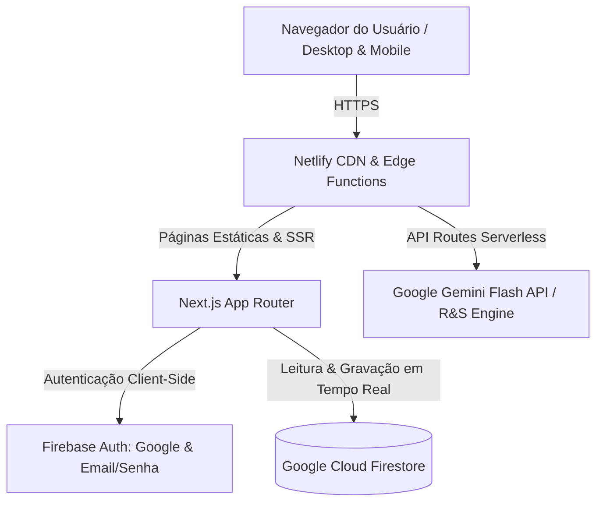

# Guia de Infraestrutura & Deploy: Netlify + Firebase
## Consultor de Inteligência em R&S — Live Consultoria

Este documento contém todas as instruções técnicas, configurações e regras para publicação da plataforma web no **Netlify**, com autenticação e persistência de dados no **Google Firebase (Auth & Cloud Firestore)**.

---

## 🏗️ 1. Arquitetura da Solução



- **Frontend & Serverless:** Next.js (App Router) publicado no **Netlify**.
- **Autenticação:** Firebase Authentication.
- **Banco de Dados:** Google Cloud Firestore (NoSQL em tempo real).
- **Motor de IA:** Google Gemini API via rotas `/api/generate-job`, `/api/generate-interview-guide` e `/api/analyze-candidate`.

---

## 🚀 2. Publicação no Netlify

### 2.1 Arquivo `netlify.toml`
Crie ou confirme a existência do arquivo `netlify.toml` na raiz do projeto:

```toml
[build]
  command = "npm run build"
  publish = ".next"

[[plugins]]
  package = "@netlify/plugin-nextjs"

[build.environment]
  NODE_VERSION = "20.12.0"
  NPM_FLAGS = "--legacy-peer-deps"

[[headers]]
  for = "/*"
  [headers.values]
    X-Frame-Options = "DENY"
    X-XSS-Protection = "1; mode=block"
    X-Content-Type-Options = "nosniff"
    Referrer-Policy = "strict-origin-when-cross-origin"
```

### 2.2 Passo a Passo de Deploy no Netlify
1. Conecte o repositório GitHub (`Clebito2/recrutaai` ou o repositório privado da Live Consultoria) ao **Netlify**.
2. Defina as seguintes configurações de build:
   - **Base directory:** *(deixar em branco se o repositório for a raiz do app, ou apontar para a pasta do app)*
   - **Build command:** `npm run build`
   - **Publish directory:** `.next`
3. Instale o plugin `@netlify/plugin-nextjs` via Netlify Dashboard ou via `npm install --save-dev @netlify/plugin-nextjs`.
4. Configure as Variáveis de Ambiente no painel do Netlify (ver Seção 4).

---

## 🔥 3. Configuração do Firebase

### 3.1 Serviços Habilitados no Console do Firebase
1. Acesse [Firebase Console](https://console.firebase.google.com/) e selecione ou crie o projeto: `recrutaai-live`.
2. **Authentication:**
   - Em *Sign-in method*, ative:
     - **Email/Senha** (com verificação de email opcional).
     - **Google Sign-In** (adicione o domínio gerado pelo Netlify, ex: `recrutaai-live.netlify.app`, na lista de *Authorized domains*).
3. **Cloud Firestore:**
   - Crie o banco de dados em modo de produção na região mais próxima (ex: `southamerica-east1` - São Paulo).

### 3.2 Esquema de Coleções do Firestore

#### Coleção: `users`
Armazena perfis de recrutadores/gestores e assinaturas.
```json
{
  "uid": "USER_UID",
  "email": "gestor@empresa.com.br",
  "name": "Cléber",
  "company": "Ecossistema Live",
  "role": "admin",
  "subscription": {
    "status": "active",
    "tier": "pro",
    "jobsLimit": 10,
    "cvAnalysisLimit": 100
  },
  "createdAt": "TIMESTAMP"
}
```

#### Coleção: `jobs`
Armazena os perfis estruturados das vagas.
```json
{
  "userId": "USER_UID",
  "title": "Executivo de Vendas B2B",
  "family": "comercial",
  "archetype": "Hunter Agressivo",
  "motivator": "Comissão Agressiva e Desafio",
  "workModel": "Híbrido (Campinas/SP)",
  "salary": "R$ 4.500 fixo + OTE R$ 12.000",
  "mustHaves": "Superior completo, 2+ anos em vendas consultivas B2B, residência em Campinas",
  "niceToHaves": "Experiência com CRM Hubspot e vendas de tecnologia",
  "customWeights": {
    "comportamental": 35,
    "tecnica": 25,
    "pratica": 25,
    "alinhamento": 15
  },
  "jobDescription": "TEXTO_SOBRIO_GERADO_PELA_IA",
  "interviewGuide": "ROTEIRO_SOCRATICO_COM_ROLE_PLAY_E_COACHABILITY",
  "repositoryUrl": "https://drive.google.com/drive/folders/EXEMPLO",
  "createdAt": "TIMESTAMP"
}
```

#### Coleção: `candidates`
Armazena as análises de cada candidato.
```json
{
  "userId": "USER_UID",
  "jobId": "JOB_DOCUMENT_ID",
  "candidateName": "Nome do Candidato",
  "cvText": "TEXTO_EXTRAIDO_DO_CV",
  "transcript": "TEXTO_TRANSCRIÇÃO_OPCIONAL",
  "family": "comercial",
  "gateCheck": {
    "status": "APROVADO",
    "requisitos_faltantes": [],
    "justificativa": "Candidato cumpre todos os requisitos eliminatórios."
  },
  "scorePonderado": 8.4,
  "formulaCalculo": "(Comportamental 8.5 * 0.35) + (Técnica 8.0 * 0.25) + (Prática 9.0 * 0.25) + (Alinhamento 8.0 * 0.15) = 8.42",
  "scores": {
    "comportamental": 8.5,
    "tecnica": 8.0,
    "pratica": 9.0,
    "alinhamento": 8.0
  },
  "swot": {
    "forcas": ["Histórico comprovado de bater metas acima de 120%"],
    "fraquezas": ["Pouca experiência com grandes contas Enterprise"],
    "oportunidades": ["Treinamento rápido na metodologia interna"],
    "ameacas": ["Expectativa de crescimento muito acelerada"]
  },
  "star": {
    "situacao": "Queda de 30% no pipeline no trimestre anterior",
    "tarefa": "Reestruturar prospecção ativa fria",
    "acao": "Implementou cadência de ligações e social selling",
    "resultado": "Recuperou pipeline para 140% da meta em 60 dias"
  },
  "temperamento": "Colérico-Sanguíneo",
  "recomendacao": "Avançar",
  "createdAt": "TIMESTAMP"
}
```

#### Coleção: `interviews`
Armazena entrevistas agendadas.
```json
{
  "userId": "USER_UID",
  "candidateName": "Nome do Candidato",
  "candidateId": "CANDIDATE_DOCUMENT_ID",
  "jobId": "JOB_DOCUMENT_ID",
  "scheduledAt": "TIMESTAMP",
  "location": "Google Meet / Sala Presencial 2",
  "notes": "Focar nas perguntas do Cenário B de Role Play",
  "status": "scheduled"
}
```

---

### 3.3 Regras de Segurança do Firestore (`firestore.rules`)
Copie e aplique estas regras no console do Firebase para garantir isolamento estrito entre usuários:

```javascript
rules_version = '2';
service cloud.firestore {
  match /databases/{database}/documents {
    
    // Funções utilitárias de segurança
    function isAuthenticated() {
      return request.auth != null;
    }
    
    function isOwner(userId) {
      return isAuthenticated() && request.auth.uid == userId;
    }

    // Regras de Usuários
    match /users/{userId} {
      allow read, write: if isOwner(userId);
    }

    // Regras de Vagas
    match /jobs/{jobId} {
      allow read, write: if isAuthenticated() && resource.data.userId == request.auth.uid;
      allow create: if isAuthenticated() && request.resource.data.userId == request.auth.uid;
    }

    // Regras de Candidatos
    match /candidates/{candidateId} {
      allow read, write: if isAuthenticated() && resource.data.userId == request.auth.uid;
      allow create: if isAuthenticated() && request.resource.data.userId == request.auth.uid;
    }

    // Regras de Entrevistas
    match /interviews/{interviewId} {
      allow read, write: if isAuthenticated() && resource.data.userId == request.auth.uid;
      allow create: if isAuthenticated() && request.resource.data.userId == request.auth.uid;
    }
  }
}
```

---

## 🔑 4. Variáveis de Ambiente

Configure as seguintes chaves no Netlify (*Site configuration > Environment variables*) e no seu arquivo local `.env.local`:

```env
# Firebase Client SDK
NEXT_PUBLIC_FIREBASE_API_KEY="AIzaSy..."
NEXT_PUBLIC_FIREBASE_AUTH_DOMAIN="recrutaai-live.firebaseapp.com"
NEXT_PUBLIC_FIREBASE_PROJECT_ID="recrutaai-live"
NEXT_PUBLIC_FIREBASE_STORAGE_BUCKET="recrutaai-live.firebasestorage.app"
NEXT_PUBLIC_FIREBASE_MESSAGING_SENDER_ID="1234567890"
NEXT_PUBLIC_FIREBASE_APP_ID="1:1234567890:web:abcdef"

# Google Gemini API (Engine de R&S)
GEMINI_API_KEY="AIzaSy..."

# Configurações do App
NEXT_PUBLIC_APP_URL="https://recrutaai-live.netlify.app"
```

---

Com este guia, o Web Designer e Desenvolvedor IA têm tudo o que é necessário para colocar a plataforma em produção com segurança e alta performance no Netlify.
