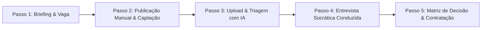

# Manual do Web Designer (IA) — Recrutamento & Seleção Inteligente
## Ecossistema Live Consultoria

Este manual é o guia definitivo de **Design de Interface (UI), Experiência do Usuário (UX) e Arquitetura de Interação** para a construção da plataforma web do **Consultor de Inteligência em R&S da Live Consultoria**.

A plataforma deve ser construída com foco em **clareza radical, elegância corporativa e condução passo a passo**, orientando o gestor ou recrutador em cada etapa do processo seletivo, com instruções amigáveis sobre o que preencher, quais documentos enviar e quais ações manuais executar.

---

## 🎨 1. Design System — Identidade Visual Live Consultoria

A interface deve refletir o padrão de excelência da Live Consultoria: sóbria, tecnológica, sem excessos de cores ou distrações.

### 1.1 Paleta de Cores (Design Tokens)
```css
:root {
  /* Fundo e Estrutura Deep Tech */
  --live-deep: #06192a;           /* Fundo principal escuro e imersivo */
  --live-surface: #0c243b;        /* Fundo de cards e modais */
  --live-surface-light: #14324f;  /* Cards em hover ou destaque secundário */
  --live-border: rgba(255, 255, 255, 0.08); /* Bordas sutis de vidro */
  
  /* Verde Live (Ação Primária / Destaque de Inteligência) */
  --live-accent: #00e800;         /* Botões de conversão, badges positivos, scorecards */
  --live-accent-hover: #00c700;   /* Hover de botões primários */
  --live-accent-glow: rgba(0, 232, 0, 0.15); /* Fundo de badges e seleções ativas */

  /* Textos e Hierarquia */
  --text-primary: #ffffff;        /* Títulos e valores críticos */
  --text-secondary: #94a3b8;      /* Rótulos, descrições, subtítulos e instruções */
  --text-muted: #64748b;          /* Metadados, datas, notas de rodapé */

  /* Semáforo de Decisão */
  --status-approved: #00e800;     /* Avançar */
  --status-warning: #f59e0b;      /* Avançar com Ressalvas / Investigar */
  --status-rejected: #ef4444;     /* Reprovar (Gate Check) */
  --status-pool: #3b82f6;         /* Banco de Talentos */
}
```

### 1.2 Tipografia
- **Títulos e Ações:** `Poppins`, `Inter` ou `sans-serif` (pesos 600 e 700). Títulos limpos, sem itálicos desnecessários.
- **Corpo e Rótulos:** `Inter`, `Roboto` ou `system-ui` (pesos 400 e 500), `line-height: 1.6`.
- **Pareceres Executivos e Diagnósticos:** `Merriweather`, `Georgia` ou `serif` com `font-style: italic` e cor `#e2e8f0` para conferir autoridade de consultoria C-Level.

### 1.3 Princípio Glassmorphism Corporativo
- Cartões com fundo semitransparente: `background: rgba(12, 36, 59, 0.7); backdrop-filter: blur(12px); border: 1px solid var(--live-border); border-radius: 12px;`.
- Sombras suaves com tom azulado escuro: `box-shadow: 0 8px 32px 0 rgba(0, 0, 0, 0.37);`.

---

## 🧭 2. Jornada do Usuário & Fluxo Operacional Guiado

A interface deve guiar o usuário em uma jornada de **5 Passos Claros**. Cada tela deve conter uma caixa de orientação inicial (*"O que fazer nesta etapa"*), campos com *placeholders* explicativos e avisos sobre as ações manuais que o usuário precisa cumprir fora do sistema.



---

## 🖥️ 3. Especificação Detalhada das Telas

### TELA 1: Painel Geral (Dashboard & Boas-Vindas)
- **Objetivo:** Mostrar o panorama dos processos seletivos e conduzir o usuário ao próximo passo.
- **Elementos Obrigatórios:**
  1. **Header com Saudação e CTA Primário:** `"Nova Vaga Inteligente"` e `"Analisar Candidato"`.
  2. **Cards de Métricas:**
     - *Vagas em Andamento*
     - *Candidatos Triados*
     - *Entrevistas Agendadas*
  3. **Guia Rápido de Uso (Banner Dismissible):**
     > *"Bem-vindo ao Ecossistema Live R&S. Siga o fluxo em 3 etapas: (1) Crie o perfil da vaga com pesos personalizados, (2) Colete os currículos e faça o upload para triagem automática com Gate Check, (3) Use o roteiro socrático na entrevista para tomar a melhor decisão."*

---

### TELA 2: Arquiteto de Vagas (Modo 1 — Definição da Vaga & Roteiro)
- **Objetivo:** Coletar os requisitos essenciais e gerar: (a) o Anúncio Oficial sem clichês, e (b) o Roteiro Socrático de Entrevista.
- **Card de Instrução Amigável no Topo:**
  ```html
  <div class="guide-box">
    <h4>📋 Como estruturar sua vaga:</h4>
    <p>Preencha os dados abaixo com o máximo de precisão. Lembre-se: os <strong>Requisitos Obrigatórios</strong> servirão como barreira eliminatória automática (Gate Check) para os candidatos.</p>
  </div>
  ```
- **Campos do Formulário com Orientações de Preenchimento:**
  1. **Título do Cargo:** Ex: *Executivo de Contas B2B (Inside Sales)*.
  2. **Família Funcional do Cargo (Seletor Interativo com 6 opções):**
     - *Comercial / Vendas* (Foco em ambição, resiliência e histórico de metas).
     - *Atendimento / CS* (Foco em escuta ativa, empatia e resolução de conflitos).
     - *Operações / Administrativo* (Foco em rigor, pontualidade e controle).
     - *Técnico / Especialista* (Foco em profundidade técnica e resolução de problemas).
     - *Liderança / Gestão* (Foco em clareza de direção, desenvolvimento e feedback).
     - *Outro / Personalizado* (Pesos equilibrados configuráveis).
  3. **Pesos do Scorecard (Painel com Sliders e validação em tempo real somando 100%):**
     - *Comportamental* (%)
     - *Técnica* (%)
     - *Prática* (%)
     - *Alinhamento Cultural & Operacional* (%)
  4. **Requisitos Obrigatórios (Eliminatórios):**
     - *Placeholder:* "Liste apenas o que desclassifica imediatamente o candidato caso não possua. Ex: Superior completo em Direito, OAB ativa, experiência mínima de 2 anos em contencioso cível, residência em Campinas/SP."
     - *Dica UI:* "Candidatos sem estes itens serão reprovados automaticamente pelo Gate Check."
  5. **Requisitos Desejáveis (Diferenciais):**
     - *Placeholder:* "Habilidades que somam pontos mas não eliminam. Ex: Inglês intermediário, vivência com CRM Salesforce."
  6. **Modelo de Trabalho & Compensação:**
     - Modelo: Presencial / Híbrido / Remoto.
     - Faixa Salarial / OTE (On Target Earnings) + Benefícios corporativos.
  7. **Link da Pasta do Drive / ATS do Cliente:**
     - Campo de texto opcional para guardar o link onde o usuário arquivará os currículos recebidos daquela vaga.

- **Resultado da Geração da IA (Exibição em Abas Elegantes):**
  - **Aba 1: Anúncio Oficial da Vaga:**
    - Texto pronto, formatado, sem jargões tóxicos ("ninja", "rockstar") e sem emojis infantis.
    - Botão de ação: `[Copiar Anúncio]`.
    - **Instrução de Ação Manual:** *"Copie este texto e publique na sua página de carreiras, LinkedIn Jobs, Gupy, Catho ou envie nos grupos de divulgação."*
  - **Aba 2: Roteiro Socrático de Entrevista:**
    - Perguntas investigativas por competência.
    - O que ouvir vs O que investigar (Red Flags).
    - **Simulação / Role Play (Cenários A & B)** com critérios objetivos de avaliação.
    - **Teste de Coachability:** instrução para dar um feedback deliberado ao candidato e ver como ele reage.
    - Botão de ação: `[Copiar Roteiro]` ou `[Baixar Roteiro PDF]`.

---

### TELA 3: Analista de Candidatos (Modo 2 — Triagem & Avaliação)
- **Objetivo:** O usuário insere os materiais do candidato e a IA processa o Gate Check eliminatório, calcula os 4 pilares e gera o parecer.
- **Card de Instrução Amigável no Topo:**
  ```html
  <div class="guide-box">
    <h4>📄 Materiais do Candidato para Análise:</h4>
    <p>Selecione a vaga correspondente. Em seguida, anexe o <strong>Currículo</strong> (PDF ou DOCX) e, opcionalmente, a <strong>Transcrição do Áudio da Entrevista</strong> ou respostas em vídeo para uma análise comportamental aprofundada.</p>
  </div>
  ```
- **Formulário de Entrada:**
  1. **Seletor de Vaga Criada:** Seleciona uma das vagas cadastradas (já carrega automaticamente a família funcional e os pesos definidos).
  2. **Upload do Currículo:**
     - Formatos: `.pdf`, `.docx` ou `.txt` (tamanho máx: 10MB).
     - Área de Drag & Drop com feedback visual (barra de progresso).
  3. **Transcrição da Entrevista / Áudio (Opcional):**
     - Campo de texto amplo para colar a transcrição gerada por ferramentas como Google Meet, Zoom, Whisper ou anotações manuais da entrevista.
  4. **Botão de Ação Primária:**
     - `[Processar Inteligência do Candidato]` (com spinner e etapas visuais: *Lendo arquivo -> Analisando requisitos obrigatórios -> Calculando pilares -> Gerando Parecer*).

- **Painel de Exibição dos Resultados:**
  1. **Banner de Gate Check:**
     - Se REPROVADO: Banner vermelho com destaque: *"Candidato não atende aos requisitos obrigatórios eliminatórios"*, listando claramente quais itens faltam.
     - Se APROVADO: Selo verde com *"Requisitos obrigatórios confirmados"*.
  2. **Scorecard Ponderado nos 4 Pilares:**
     - Exibição em cards com barras de progresso:
       - *Comportamental* (Nota 0-10)
       - *Técnica* (Nota 0-10)
       - *Prática* (Nota 0-10)
       - *Alinhamento Cultural* (Nota 0-10)
     - **Banner da Equação Auditável:** Mostra como a nota foi obtida: `(Comportamental × Peso% + Técnica × Peso% + ...) / 100 = Nota Final`.
  3. **Matriz SWOT em 4 Quadrantes Cromáticos:**
     - Forças (Verde), Fraquezas (Laranja), Oportunidades (Azul), Ameaças/Riscos (Vermelho).
  4. **Metodologia STAR com Métricas Reais:**
     - Situação, Tarefa, Ação e Resultados comprovados com dados numéricos.
  5. **Análise de Temperamento:**
     - Temperamento predominante e secundário (ex: *Colérico-Fleumático* com boa assertividade e controle sob pressão).
  6. **Lacunas / Informações Faltantes:**
     - Pontos que não constavam no material e que o entrevistador deve checar antes de aprovar.

---

### TELA 4: Relatório Executivo Protocolo Elite & Comparador Multi-Candidatos
- **Objetivo:** Fornecer os entregáveis finais para tomada de decisão com os sócios/diretores ou clientes da consultoria.
- **Ações Disponíveis:**
  1. **Exportar Relatório Visual HTML (Protocolo Elite):**
     - Botão `[Baixar Relatório HTML da Live]` que gera o arquivo executivo completo com a identidade visual da Live, apto para ser compartilhado por email, anexo ou aberto em qualquer navegador.
  2. **Matriz de Decisão Multi-Candidatos (Tabela Comparativa):**
     - Tabela dinâmica que lista todos os candidatos daquela vaga lado a lado.
     - Colunas: *Nome, Data, Score Final, Status do Gate Check, Nota Comportamental, Nota Técnica, Recomendação (Avançar/Ressalva/Reprovado)*.
     - Permite ordenar por pontuação para identificar imediatamente o melhor talento do processo.
  3. **Instruções Manuais para o Fechamento:**
     - *"Após escolher o candidato final, use o Roteiro de Checagem de Referências da Live e envie a Carta Proposta com alinhamento de data de início."*

---

## 📱 4. Diretrizes de Responsividade e Micro-Interações

1. **Mobile-First Responsivo:** Todas as tabelas e grids devem quebrar de 4/2 colunas para 1 coluna em telas menores que 768px.
2. **Tooltips Explicativos:** Em cada campo ou métrica (ex: *"O que é OTE?"*, *"Como funciona o teste de Coachability?"*), colocar um ícone de interrogação `(?)` com tooltip descritivo.
3. **Feedback de Cópia e Salvamento:** Notificações flutuantes (*Toasts*) discretas verdes no canto inferior direito quando o usuário copiar anúncios, roteiros ou salvar vagas.
4. **Zero Travamento:** Nenhuma tela deve exigir dados obrigatórios além do estritamente necessário para que o usuário não fique preso.

---

Este manual deve ser utilizado integralmente pela IA Web Designer para guiar a criação de componentes, templates e fluxos do usuário.
